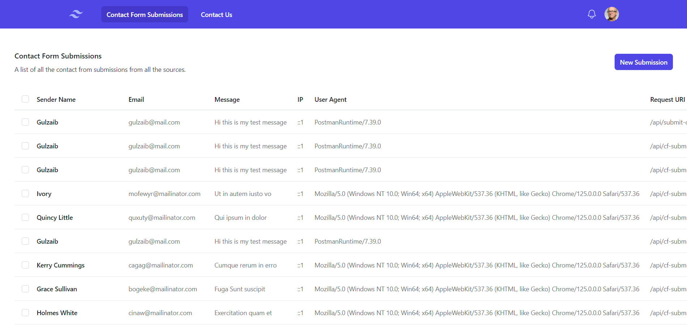
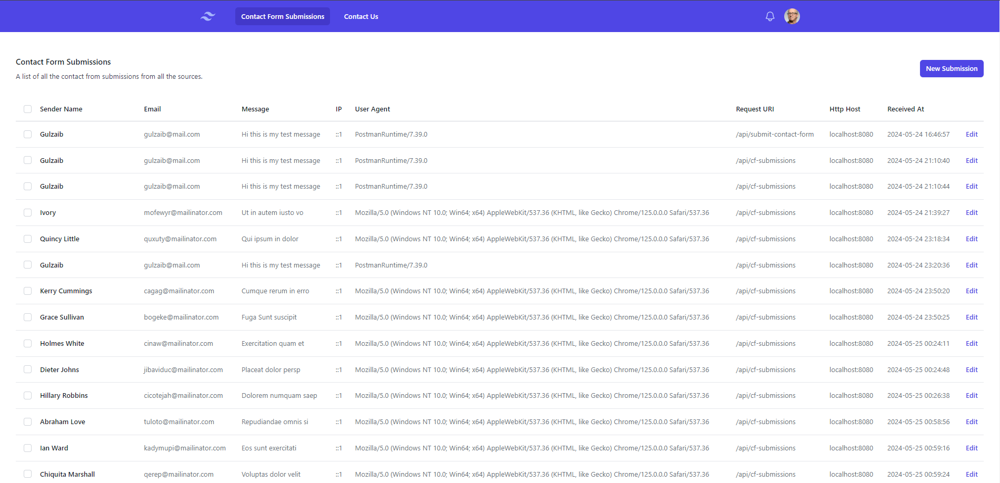
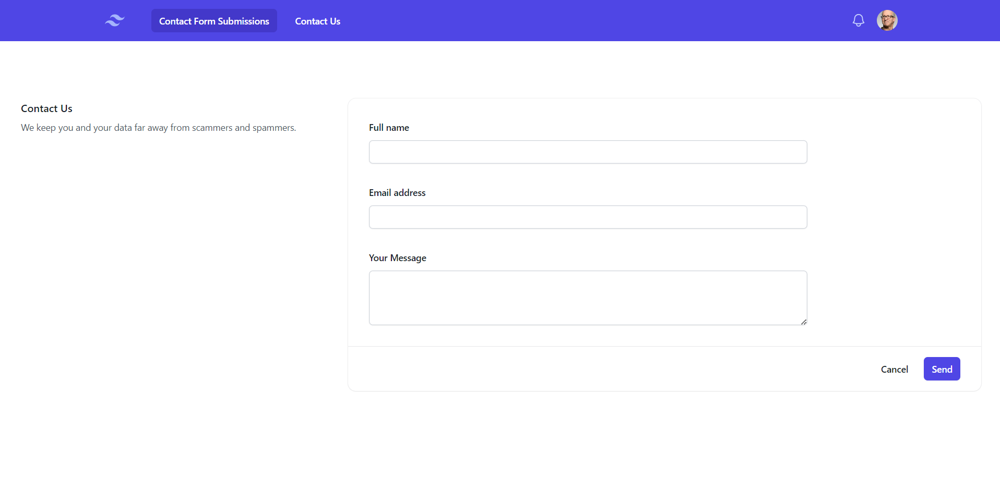
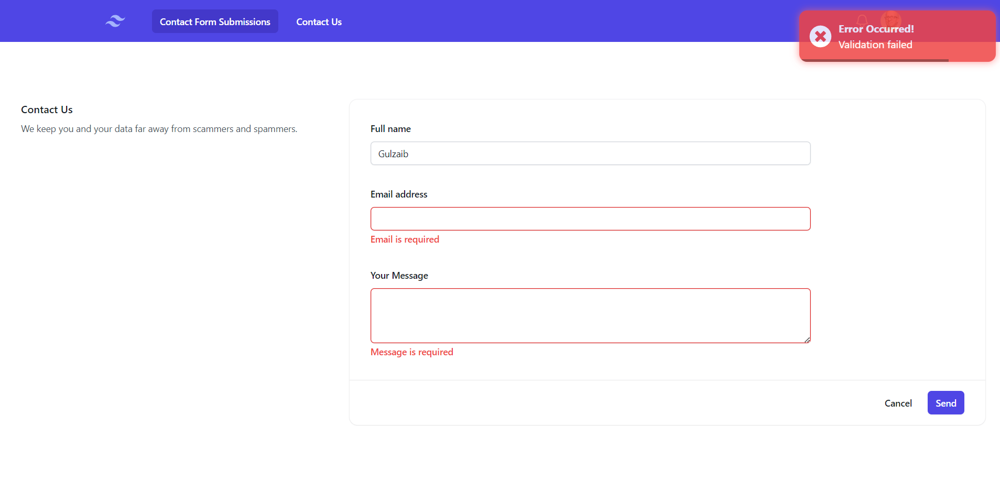
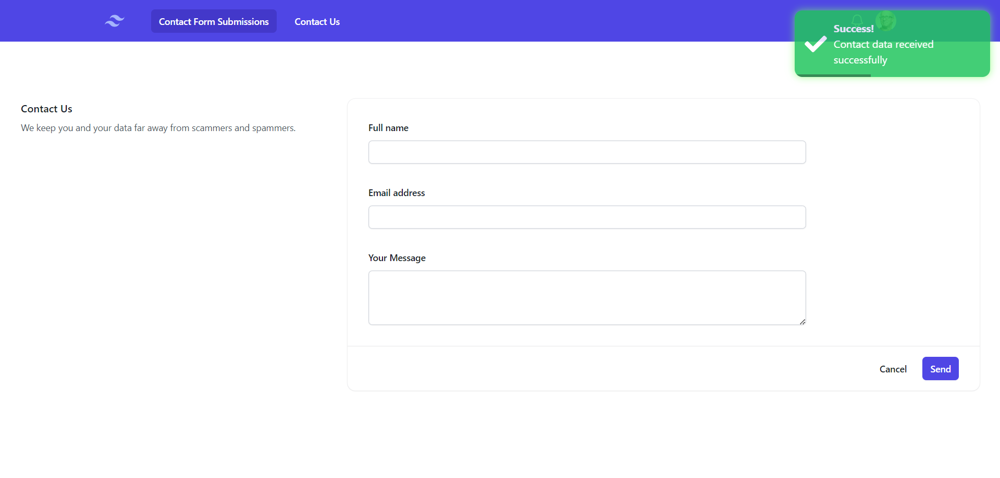

# Ease Cloud App

Simple Angular Web App with API requests.

## Tech Stack

- Angular 
- Typescript
- Tailwind CSS
- Postcss
- NGX Toastr

## Installation Guide

1. Clone the project or download zip.
2. Navigate to the root directory of the application.
3. Run `npm install` to install the dependencies i.e. `vendor/` directory.
4. Serve the app by running `ng serve`

## UI Overview

### Home Page Screenshot

### Contact Us Page Screenshot

### Contact Us Page ERROR Screenshot

### Contact Us Page SUCCESS Screenshot

